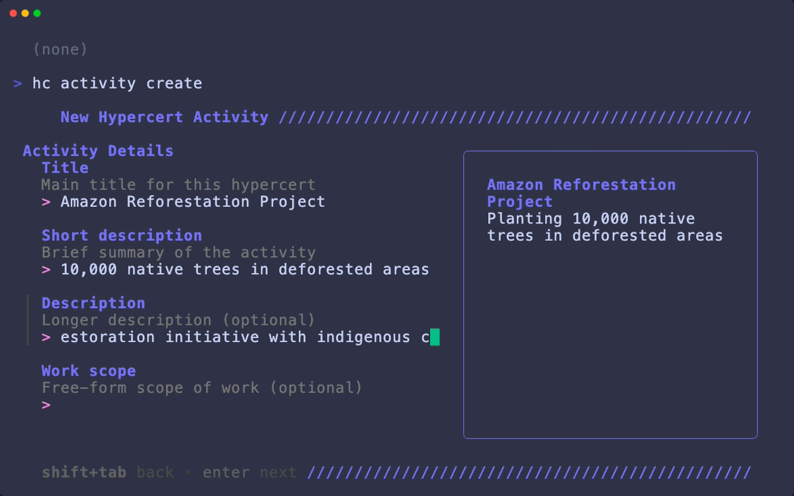

# Hypercerts CLI

<p align="center">
  
</p>

A command-line tool for managing [Hypercerts](https://hypercerts.org) on the [AT Protocol](https://atproto.com). Create, edit, and manage impact claims, measurements, locations, attachments, and contributors — interactively or with flags.

## Install

```bash
# Quick install
curl -sSL https://raw.githubusercontent.com/GainForest/hypercerts-cli/main/install.sh | bash

# Or via Go (requires Go 1.25+)
go install github.com/GainForest/hypercerts-cli/cmd/hc@latest

# Or build from source
git clone https://github.com/GainForest/hypercerts-cli && cd hypercerts-cli && make build
```

## Quick Start

```bash
hc account login -u yourhandle.example.com -p your-app-password

hc activity create --title "Rainforest Carbon Study" --description "12-month carbon sequestration measurement"
hc measurement create --metric "carbon sequestered" --unit "tonnes CO2" --value "1500"
hc location create --lat -3.4653 --lon -62.2159 --name "Amazon Basin Site A"
hc attachment create --title "Field Report Q1" --uri "https://example.com/reports/q1-2025.pdf"

hc activity ls
```

## Commands

```
hc
├── account login/logout/status
├── activity create/edit/delete/ls/get      Hypercert claims
├── measurement create/edit/delete/ls       Impact metrics (alias: meas)
├── location create/edit/delete/ls          Geographic coords (alias: loc)
├── attachment create/edit/delete/ls        Evidence docs (alias: attach)
├── rights create/edit/delete/ls            Licenses
├── evaluation create/edit/delete/ls        Third-party eval (alias: eval)
├── collection create/edit/delete/ls        Project grouping (alias: coll)
├── funding create/edit/delete/ls           Funding receipts (alias: fund)
├── workscope create/edit/delete/ls         Scope tags (alias: ws)
├── contributor create/edit/delete/ls       People (alias: contrib)
├── contribution create/edit/delete/ls      Contribution details
├── acknowledgement create/edit/delete/ls   Bidirectional links (alias: ack)
├── badge create/edit/delete/ls             Badges
├── profile create/edit/delete/ls           Actor profiles
├── organization create/edit/delete/ls      Org metadata (alias: org)
└── get/ls/resolve                          Generic record ops
```

Run `hc <command> --help` for usage details.

## Data Model

The **activity claim** is the core hypercert — the anchor for all impact tracking. Other records reference it to add context. Records can be created by different people and live in different repositories.

```
                         ┌──────────────────┐
              ┌──────────│  Activity Claim   │──────────┐
              │          │   (hypercert)     │          │
              │          └──────┬───────┬────┘          │
              │                 │       │               │
              │    ┌────────────┤       ├────────────┐  │
              │    │            │       │            │  │
              ▼    ▼            ▼       ▼            ▼  ▼
         ┌────────────┐  ┌──────────┐  ┌──────────┐  ┌────────────┐
         │Measurement │  │Attachment│  │ Location │  │Contributor │
         │ (metrics)  │  │(evidence)│  │  (geo)   │  │  (people)  │
         └──────┬─────┘  └──────────┘  └──────────┘  └────────────┘
                │
                ▼
         ┌────────────┐  ┌──────────┐  ┌──────────┐  ┌────────────┐
         │ Evaluation │  │  Rights  │  │ Funding  │  │    Ack     │
         │ (3rd-party)│  │(license) │  │(receipts)│  │ (consent)  │
         └────────────┘  └──────────┘  └──────────┘  └────────────┘

         ┌────────────┐
         │ Collection │  ← groups activities into projects
         └────────────┘
```

- **Measurements** link to activities via `subjects[]` — quantitative impact data (e.g. "50 tonnes CO₂ reduced")
- **Attachments** link to any record via `subjects[]` — supporting docs, URLs, IPFS links
- **Evaluations** reference activities via `subject` and can cite `measurements[]` as evidence
- **Contributors** are embedded in activities via `contributors[]` with weights and roles
- **Locations** are referenced from activities via `locations[]` (Location Protocol v1.0)
- **Rights** are referenced from activities — licenses and usage terms
- **Funding Receipts** link funders to recipients, optionally referencing the activity funded
- **Acknowledgements** express consent — a contributor confirms their inclusion, a funder confirms a receipt
- **Collections** group activities (and other collections) into projects or portfolios

See the [full data model docs](https://docs.hypercerts.org/core-concepts/hypercerts-core-data-model) and [lexicon reference](https://docs.hypercerts.org/lexicons/introduction-to-lexicons) for details.

## Environment Variables

| Variable | Description |
|----------|-------------|
| `HYPER_USERNAME` | Handle or DID for auth |
| `HYPER_PASSWORD` | App password for auth |
| `ATP_PDS_HOST` | Override PDS URL |
| `ATP_PLC_HOST` | Override PLC directory URL (default: `https://plc.directory`) |
| `HYPER_LOG_LEVEL` | Log level: error, warn, info, debug |

These can also be set in a `.env` file.

## Development

```bash
make build          # Build binary
make test           # Run tests
make lint           # Lint
make fmt            # Format
```

## License

See [LICENSE](LICENSE) for details.
