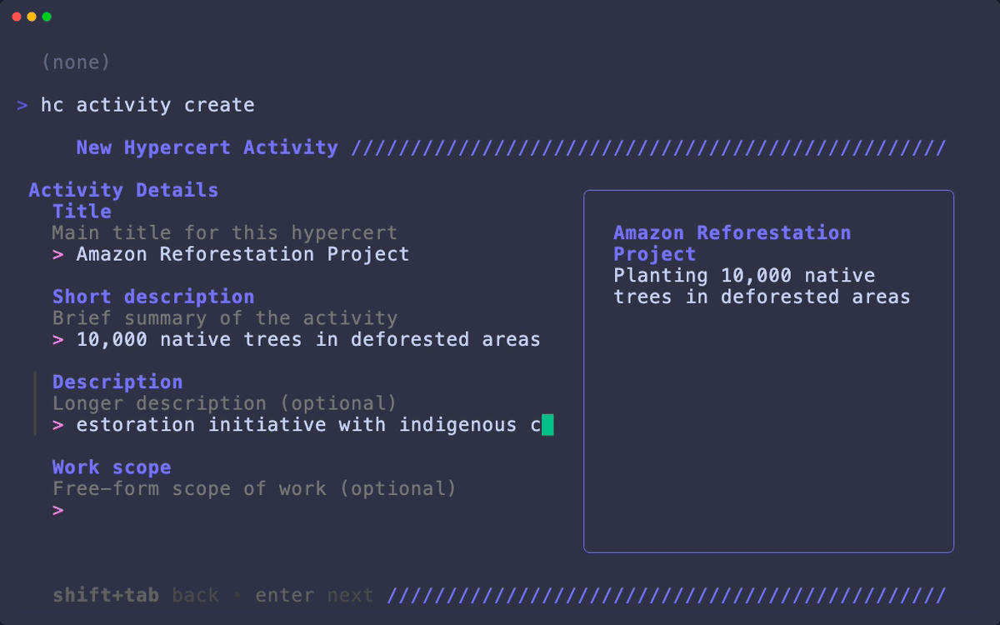

> [!CAUTION]
> ⚠️ **The Hypercerts CLI is being deprecated.** Do not use it for new integrations. Existing users can refer to this repository for the CLI's current documentation.

# Hypercerts CLI

<p align="center">
  
</p>

A command-line tool for managing [Hypercerts](https://hypercerts.org) on the [AT Protocol](https://atproto.com). Create, edit, and manage impact claims, measurements, locations, attachments, and contributors — interactively or with flags.

## Install

```bash
# Quick install
curl -sSL https://raw.githubusercontent.com/GainForest/hypercerts-cli/main/install.sh | bash

# Or via Go (requires Go 1.25+)
go install github.com/GainForest/hypercerts-cli/cmd/hc@latest

# Or build from source
git clone https://github.com/GainForest/hypercerts-cli && cd hypercerts-cli && make build
```

## Quick Start

```bash
hc account login -u yourhandle.example.com -p your-app-password

hc activity create --title "Rainforest Carbon Study" --description "12-month carbon sequestration measurement"
hc measurement create --metric "carbon sequestered" --unit "tonnes CO2" --value "1500"
hc location create --lat -3.4653 --lon -62.2159 --name "Amazon Basin Site A"
hc attachment create --title "Field Report Q1" --uri "https://example.com/reports/q1-2025.pdf"

hc activity ls
```

## Commands

```
hc
├── account login/logout/status
├── activity create/edit/delete/ls/get      Hypercert claims
├── measurement create/edit/delete/ls       Impact metrics (alias: meas)
├── location create/edit/delete/ls          Geographic coords (alias: loc)
├── attachment create/edit/delete/ls        Evidence docs (alias: attach)
├── rights create/edit/delete/ls            Licenses
├── evaluation create/edit/delete/ls        Third-party eval (alias: eval)
├── collection create/edit/delete/ls        Project grouping (alias: coll)
├── funding create/edit/delete/ls           Funding receipts (alias: fund)
├── workscope create/edit/delete/ls         Scope tags (alias: ws)
├── contributor create/edit/delete/ls       People (alias: contrib)
├── contribution create/edit/delete/ls      Contribution details
├── acknowledgement create/edit/delete/ls   Bidirectional links (alias: ack)
├── badge create/edit/delete/ls             Badges
├── profile create/edit/delete/ls           Actor profiles
├── organization create/edit/delete/ls      Org metadata (alias: org)
└── get/ls/resolve                          Generic record ops
```

Run `hc <command> --help` for usage details.

## Data Model

```
                    ┌─────────────────┐
                    │    Activity     │
                    │  (hypercert)    │
                    └────────┬────────┘
                             │
     ┌───────────┬───────────┼───────────┬───────────┬───────────┐
     │           │           │           │           │           │
     ▼           ▼           ▼           ▼           ▼           ▼
┌─────────┐ ┌─────────┐ ┌─────────┐ ┌─────────┐ ┌─────────┐ ┌─────────┐
│Measuremt│ │Attachmnt│ │Contribut│ │ Rights  │ │Location │ │Evaluatn │
│(metrics)│ │(evidence│ │ (people)│ │(license)│ │ (geo)   │ │(3rd pty)│
└────┬────┘ └────┬────┘ └─────────┘ └─────────┘ └─────────┘ └────┬────┘
     │           │                                               │
     ▼           ▼                                               ▼
┌─────────┐ ┌─────────┐                                    ┌─────────┐
│Location │ │Location │                                    │Measuremt│
│(optional│ │(optional│                                    │(linked) │
└─────────┘ └─────────┘                                    └─────────┘
```

- Measurements link to activities via `subject` (strongRef)
- Attachments link to activities via `subjects[]` (array of strongRefs)
- Contributors are embedded in activities via `contributors[]`
- Rights link to activities via `rights` (strongRef)
- Locations link to activities via `locations[]` (array of strongRefs)
- Evaluations link to activities via `subject` and can include `measurements[]`

## Environment Variables

| Variable | Description |
|----------|-------------|
| `HYPER_USERNAME` | Handle or DID for auth |
| `HYPER_PASSWORD` | App password for auth |
| `ATP_PDS_HOST` | Override PDS URL |
| `ATP_PLC_HOST` | Override PLC directory URL (default: `https://plc.directory`) |
| `HYPER_LOG_LEVEL` | Log level: error, warn, info, debug |

These can also be set in a `.env` file.

## Development

```bash
make build          # Build binary
make test           # Run tests
make lint           # Lint
make fmt            # Format
```

## License

See [LICENSE](LICENSE) for details.
